# Planejamento projeto Foguete Propulsão Híbrida

Nome: Boto Cor de rosa (sugestão de nome, por Lucas)

## Objetivo geral

Desenvolver um foguete de propulsão híbrida, com objetivo principal de aprender e entender o funcionamento do mesmo e participação em competições para validação do projeto.

  Alcançar objetivos do Polo usando propulsão híbrida.

  Observação: A priori o objetivo irá mudar a partir de novas iterações, mas usando Polo como iteração 0 irá evitar algumas dores de cabeça.

* Apogeu: 3km
* Impulso total: 12kNs
* Competição: Lasc 2025 e SAC 2026(Em caso de sucesso na Lasc)

Cada componente contara com etapas de prototipagem e desenvolvimento em escala menores.

### Objetivos específicos

#### Documentação

* Criar repositorio do github como documentação do projeto e para facilitar a colaboração, usando markdown e seguindo como modelo padrões de documentação de softwares livres, levando em conta que os conhecimentos serão passado para futuros membros da equipe e visando replicabilidade e melhorias futuras de projeto.

* Usando o github como plataforma principal de documentação, colaboração e organização do projeto, usando o sistema de issues para organização de tarefas e o sistema de pull requests para revisão de código e documentação.

* Ao utilizar um unico repositório para documentação e implementação, quando possivel, facilitará comunicação entre componentes e a documentação será mais precisa.

#### Propelente

* LASC

  * "Note that all propellants used must be non-toxic. Ammonium perchlorate composite propellant (APCP), potassium nitrate and sugar (aka "rocket candy"), nitrous oxide, liquid oxygen (LOX), hydrogen peroxide, kerosene, propane and similar substances, are all considered non-toxic. Toxic propellants are defined as those requiring breathing apparatus, special storage, transport infrastructure, extensive personal protective equipment, etc. (e.g. Hydrazine and N2O4)"

### Controle de vazão

* LASC
  * "Hybrid and liquid propulsion systems shall implement a means for remotely controlled venting or offloading of all liquid and gaseous propellants in the event of a launch abort."

#### Paraquedas

* LASC
  
  * "Each independently recovered launch vehicle body anticipated to reach an apogee above 1500 meters AGL shall follow a "dual-event" recovery operations concept (CONOPS), including an initial deployment event (e.g. a drogue parachute deployment; reefed main parachute deployment) and a main deployment event (e.g. a main parachute deployment; main parachute un-reefing)"

##### Paraquedas Drogue

* LASC
  * "The initial deployment event for dual-event recovery shall occur at or near apogee, stabilize the vehicle's attitude (i.e. prevent tumbling), and reduce its descent rate enough to permit the main deployment event yet not so much as to exacerbate wind drift (e.g. between 20-45 m/s)."

#### Paraquedas Principal

* LASC
  * "The main deployment event shall occur at an altitude no higher than 500 meters AGL and reduce the vehicle's descent rate sufficiently to prevent excessive damage upon impact with the ground (i.e. less than 10  m/s)."

#### Payload

* LASC
  * Dimensões: 10cm x 10cm x 30cm, baseado nas dimensões de 3 cubesats.
  * "4,000 grams of payload for 3,000 meters AGL apogee."
  * "If a functional payload is chosen, with the functional part itself not providing enough mass to reach the minimum requirements, additional dummy-masses may be added to the functional payload until the minimum mass requirement is reached."
  * "Payloads shall not contain significant quantities of lead or any other hazardous materials (e.g. radioactive materials). Finally, payloads shall not contain any live animals."

## Etapas

<!-- TODO: redo using Technology readiness level https://en.wikipedia.org/wiki/Technology_readiness_level -->

Cada etapa deverá ser documentada em um relatório técnico. É estritamente recomendado que as etapas entre os componentes sejam feitas em paralelo, e que mudanças que afetem outros componentes sejam comunicadas o mais rápido possível, podendo ser usado ferramentas unificadas sempre que possível, sugiro Github e Markdown para documentação.

Usando Technology Readiness Level iremos acompanhar o desenvolvimento do projeto.

* Pesquisa e modelagem :

São as iterações de pesquisas, requisito e determinação dos modelos a serem construido.

  1. Basic principles observed and reported (1 mês)
  2. Technology concept and/or application formulated (2 meses)
  3. Analytical and experimental critical function and/or characteristic proof-of-concept (3 meses)

* Design e prototipagem :

Implementar os prototipos de cada componente em escala reduzida.

  4. Component and/or breadboard validation in a laboratory environment (4 meses)
  5. Component and/or breadboard validation in relevant environment (4 meses)
  6. System/subsystem model or prototype demonstration in a relevant environment (ground or space) (4 meses)

* Integração e implementação em escala :

Integração dos componentes, teste em escala real e lançamento.

  7. System prototype demonstration in a space environment (2 meses)
  8. Actual system completed and "flight qualified" through test and demonstration (ground or space) (2 meses)
  9. Actual system "flight proven" through successful mission operations (1 mes)

## Work breakdown structure
<!-- Utilizando https://en.wikipedia.org/wiki/Work_breakdown_structure decompor os componentes a serem desenvolvidos, e tambem as etapas/atividades/eventos a serem realizadas, como integrações e afins 
TODO?: Implementar regra dos 100%
-->

```mermaid
%%{init: {"flowchart": {"defaultRenderer": "elk"}} }%%
flowchart TD;

  Missão --> Foguete;
    Foguete --> Motor;
      Motor --> Injetor;
      Motor --> Propelente;
        Propelente --> Combustível;
        Propelente --> Oxidante;
      Motor --> combustionChamber[Câmara de combustão];
      Motor --> oxidizerTank[Tanque de Oxidante];
      Motor --> Tubeira;
      Motor --> Ignitor;
      Motor --> Válvula;
    Foguete --> Eletrônica;
      Eletrônica --> flowControl[Controle de vazão];
      Eletrônica --> ignitorAction[Acionamento do ignitor];
      Eletrônica --> Telemetria;
      Eletrônica --> chuteAction[Acionamento do paraquedas];
    Foguete --> Recuperação;
      Recuperação --> drogueChute[Paraquedas Drogue];
      Recuperação --> mainChute[Paraquedas Principal];
    Foguete --> Estrutura;
      Estrutura --> Coifa;
      Estrutura --> fixPayload[Anteparo de fixação da Payload];
      Estrutura --> bulkheadPayload[bulkhead entre Carga Paga e Recuperação principal];
      Estrutura --> couplerPayload[Coupler entre Coifa, Carga Paga e Recuperação principal];
      Estrutura --> fuselagePayload[Fuselagem da Payload];
      Estrutura --> chuteCrown[Coroa de cisalhamento da Recuperação principal];
      Estrutura --> eletronicsPlate[Placa de suporte da Eletrônica];
      Estrutura --> bulkheadEletronics[Bulkheads entre Eletrônica e as câmaras de recuperação];
      Estrutura --> drogueCrown[Coroa de cisalhamento da Recuperação piloto];
      Estrutura --> fuselageRecovery[Fuselagem das câmaras de recuperação e eletrônica];
      Estrutura --> bulkheadRecovery[Bulkhead entre Recuperação piloto e o Motor];
      Estrutura --> couplerRecovery[Coupler entre Recuperação piloto e o Motor];
      Estrutura --> fuselageMotor[Fuselagem do Motor];
      Estrutura --> fins[Conjunto de Empenas];
      Estrutura --> finsRings[Conjunto de anéis de fixação das empenas];
      Estrutura --> boatTail[Boat Tail];
    Foguete --> Integração;
  Missão --> Payload;
  Missão --> Logística;
    Logística --> Testes;
    Logística --> Lançamento;
  Missão --> Financiamento;

```

* \[Elemento\]
  * \[Documentação\]
  * \[Prototipo\]
  * \[Implementação\]
  <!-- * Requisitos -->

1. Motor
  
    1. Injetor **
    1. Propelente, (Combustível e Oxidante)
    1. Câmara de combustão
    1. Tanque de Oxidante
    1. Tubeira
    1. Ignitor **
    1. Válvula **
    1. Teste estático
1. Eletrônica
    1. Controle de vazão **
    1. Acionamento do ignitor **
    1. A definir
    <!-- TODO: Falar com pessoal do departamento -->
1. Estrutura
    <!-- TODO: Revisar aqui ver o que pode ser agrupado -->
    1. Coifa
    1. Anteparo de fixação da Payload
    1. Bulkhead entre Carga Paga e Recuperação principal
    1. Coupler entre Coifa, Carga Paga e Recuperação principal
    1. Fuselagem da Payload
    1. Coroa de cisalhamento da Recuperação principal
    1. Placa de suporte da Eletrônica
    1. Bulkheads entre Eletrônica e as câmaras de recuperação
    1. Coroa de cisalhamento da Recuperação piloto
    1. Fuselagem das câmaras de recuperação e eletrônica
    1. Bulkhead entre Recuperação piloto e o Motor
    1. Coupler entre Recuperação piloto e o Motor
    1. Fuselagem do Motor
    1. Conjunto de Empenas
    1. Conjunto de anéis de fixação das empenas
    1. Boat Tail
1. Recuperação
    1. Paraquedas Principal
    1. Paraquedas Drogue
    1. Carga explosiva
    1. Sistema de cisalhamento
        1. Coroa de cisalhamento
1. Integração
    1. Payload
    1. Eletrônica
    1. Recuperação
    1. Motor
1. Gerenciamento de Projeto
1. Carga paga
    1. A definir

** Componentes que merecem mais destaque por serem completamente novos para o grupo

## Revisões de projeto

<!-- TODO: Revisar em cima de https://en.wikipedia.org/wiki/Design_review_(U.S._government) -->
As revisões de projeto irão acompanhar o desenvolvimento do mesmo, e ajudarão a indentificar e acompanhar os passos de cada componente e do projeto como um todo. Embora exista uma ordem logica por trás das etapas a seguir é possivel que algumas precisem ser reavaliadas para adequar a demandas do projeto.

### Mission Concept Review

Examinar em quais competições o foguete irá participar, e quais os requisitos mínimos para cada competição, para que possa ser contruido a missão.

### System Requirements Review

Examinar os requisitos mínimos para cada componente, e como eles atendem aos requisitos da missão.

### Mission Definition Review

Examinar os requisitos e detalhes da Missão, sua arquitetura e planejamento.

### System Design Review

Examina o design do sistema, sua integração e consistencia com os requisitos da missão.

### Preliminary Design Review

Examinar o design preliminar de cada componente e seus prototipos, e como eles atendem aos requisitos mínimos.

### Critical Design Review

Examinar o design final de cada componente, e como eles atendem aos requisitos mínimos.

### Production Readiness Review

Examinar processo de produção e confecção dos componentes e sua integração.

### Test Readiness Review

Examinar estado dos testes de cada componente e do sistema integrado.

### System Acceptance Review

Verifica integridade e maturidade do sistema, e se ele está pronto para o lançamento.

### Operational Readiness Review

Examina se o sistema, logistica e equipe estão prontos para o lançamento.

### Flight Readiness Review

Determinar se o foguete está pronto para o lançamento.

<!-- 1. Pesquisa e levantamento teórico

    Reunir material sobre estado da arte do componente estudado, casos de sucesso, embasamento teórico, etc. "Buscar o melhor do mercado, entender e melhorar"
    Levantar os conhecimentos necessários para desenvolver e entender como é feito o componente.

1. Design e modelagem

    Ciclos iterativos de design e modelagem do componente, usando os conhecimentos adquiridos na etapa anterior, até que seja definido o projeto:

    1. Modelagem matemática/téorica
    1. Design (Desenho técnico)

        Para a iteração essa etapa consistem em criar o modelo inicial, mas para demais iterações, consiste em melhorar e implementar as mudanças necessárias.

    1. Otimização

        Remover redundâncias, simplificar, etc.

    1. Simulação

        A partir do modelo matemático, simular o comportamento do componente, e verificar se o modelo corresponde a teoria.

1. Manual de fabricação

    Desenvolver um manual pratico de confecção do componente, com os materiais necessários, ferramentas, procedimentos, etc.

1. Prototipagem e desenvolvimento de ambiente de testes

    Desenvolver um protótipo do componente, seguindo o manual de fabricação.

1. Testes

    Realizar os testes necessários para validar se o protótipo corresponde a teoria e ao modelo projetado. Caso não corresponda, voltar para a etapa 1.

1. Confecção da versão final

    Confeccionar a versão final do componente, seguindo o manual de fabricação apos validação bem sucedida dos protoótipos.

1. Teste de validação

    Realizar os testes necessários para validar se a versão final corresponde a teoria e ao modelo projetado. Caso não corresponda, verificar qual incoerência em relação aos testes anteriores e corrigir. Caso não seja possível corrigir, voltar para a etapa 1.

1. Manual de integração

    Desenvolver um manual pratico de integração do componente ao foguete, com os materiais necessários, ferramentas, procedimentos, etc.

1. Integração

    Integrar o componente ao foguete, seguindo o manual de integração.

1. Lançamento

    Alons-y! Allonso! -->

<!-- desemvolver um sistema de injeção de oxido nitroso ou oxigenio liquido na vazão correta, fabricar e caracterizar os injetores e tentar fazer a caracterização dos injetores
para parte solida: bocal (tubeira), seção cilindrica, tatamento termico pra motor de alta pressão, e tipo de combustivel solido com adição de aluminio ou algo pra aumentar o empuxo especifico
em cima disso: em uma ic, precisamos de mais de um aluno, 
-> injetor, para amortecer essa capacidade dentro de um filme líquido; -> valvula

Projeto, fabricação, ensio em institutos qualidifcados, xorrigir, integrar com o motor
sólido: queima e geometria de queima, tempo de quiema, tubeira, empuxo específico 
engenharia reversa e melhorar, com o pessoal da unb

Desafios associados: dinheiro (buscar empresas, com participação aeronautica ou não, alavancando doação, sendo abatidas do imposto de renda pela lei de incentivo à inovação, 
como criar formas de divulgar isso na empresa dele, pra ter uma visão social, vies de retono da sociedae, agregando valor social da emopresa dele
buscar recursos para organizar, integrar e ter espaço para desolver e testar os componentes, ensioa de integração, 
telemetria e controle, a ORcket não pode se limitar a alunos da aero 

"estão mais preocupados em criar uma estrutura hierarquica do que fazer os projetos"

humildade de perceber que algo tá errado e criar uma ação pra mudar, não há fluxo de conhecimento,  

e lado social da Rocket? isola um aluno de aprender por trabalhar, etc
CTA, Vibras, pq não entrar em contato com o pessoal dos centros de pesquisa

iniciações em várias frents, engajamento dos alunos nas tarefas

Bico injetor pra medir ângulo de espalhamento em combustível com reação e sem reação utilizando imagens com o sistema de schierelen

injeção
segmentado com flanges, segmentar a geometria

definir o empuxo, começar com motores pequneos e aprender a fazer, entender os parametros e as variavies, validação expeirmentação, fabricação

tempo e pessoas envolvidas, atrás de recursos financeiros

REVISAR os prazos

Utilizar Technology Readiness Level como base para desenvolvimento de projetos

Mudar visão de coisa por departamento, para ver as coisas por componentes

Analise de risco de cada etapa e ações para mitigar os riscos ( dividir em graus de riscos, descrever o risco, e qual ação tomar caso se confirme)

Utilizar metodologia initial requirement review https://en.wikipedia.org/wiki/Design_review_(U.S._government)

Proxima reunião

Lista possiveis competições para participar, baixar e entender os regulamentos
    Spaceport America Cup
    Latin American Space Challenge
    COBRUF

Entender o Design Review e metodologia de   da NASA

https://hyend.de/index.php/dlr-stern-participation/

Olexiy Shynkarenko
2015 (1)
PRELIMINARY RESEARCH OF GAS TORCH IGNITION SYSTEM FOR THE HYBRID ROCKET MOTOR
2014 (1)
Preliminary Research of the Hybrid Motor Properties for the Reentry Plat 

Autor
revisão
aprovar

-->