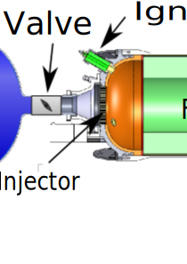

# Planejamento projeto Foguete Propulsão Híbrida

Nome: Boto Cor de rosa (sugestão de nome, por Lucas)

## Objetivo

  Alcançar objetivos do Polo usando propulsão híbrida.

  Observação: A priori o objetivo irá mudar a partir de novas iterações, mas usando Polo como iteração 0 irá evitar algumas dores de cabeça.

* Apogeu: 3km
* Impulso total: 12kNs
* Prazo final: Lasc 2025

## Etapas

Cada etapa deverá ser documentada em um relatório técnico. É estritamente recomendado que as etapas entre os componentes sejam feitas em paralelo, e que mudanças que afetem outros componentes sejam comunicadas o mais rápido possível, podendo ser usado ferramentas unificadas sempre que possível, sugiro Github e Markdown para documentação.

  1. Projeto
(Uma a duas pesquisas científicas por componente a ser desenvolvido)
      1. Pesquisa
      1. Desenvolvimento
  1. Fabricação
  1. Testes
  1. Integração
  1. Lançamento

  As etapas 1, 2 e 3 São iterativas, de modo que novas iterações podem ser necessárias para atingir os objetivos, onde a etapa deve ser alcançada apenas quando os resultados das 3 etapas anteriores satisfazerem os criterios etabelecidos.

## Componentes a serem desenvolvidos

* Motor
  
  * Injetor **
  * Combustível e Oxidante
  * Câmara de combustão
  * Tanque de Oxidante
  * Tubeira
  * Ignitor **
  * Válvula **
* Eletrônica
  * Controle de vazão **
  * Acionamento do ignitor **
  * A definir
    <!-- TODO: Falar com pessoal do departamento -->
* Estrutura
  * A definir
    <!-- TODO: Falar com pessoal do departamento -->
* Recuperação
  * A definir
    <!-- TODO: Falar com pessoal do departamento -->

** Componentes que merecem mais destaque por serem completamente novos para o grupo

## Calendario Generico

1. Pesquisa e levantamento teórico (1 mês)

    Reunir material sobre estado da arte do componente estudado, casos de sucesso, embasamento teórico, etc. "Buscar o melhor do mercado, entender e melhorar"
    Levantar os conhecimentos necessários para desenvolver e entender como é feito o componente.

1. Design e modelagem (3 mêses)

    Ciclos iterativos de design e modelagem do componente, usando os conhecimentos adquiridos na etapa anterior, até que seja definido o projeto:

    1. Modelagem matemática/téorica
    1. Design (Desenho técnico)

        Para a iteração essa etapa consistem em criar o modelo inicial, mas para demais iterações, consiste em melhorar e implementar as mudanças necessárias.

    1. Otimização

        Remover redundâncias, simplificar, etc.

    1. Simulação

        A partir do modelo matemático, simular o comportamento do componente, e verificar se o modelo corresponde a teoria.

1. Manual de fabricação (1 mês)

    Desenvolver um manual pratico de confecção do componente, com os materiais necessários, ferramentas, procedimentos, etc.

1. Prototipagem e desenvolvimento de ambiente de testes (2 mêses)

    Desenvolver um protótipo do componente, seguindo o manual de fabricação.

1. Testes (1 mês)

    Realizar os testes necessários para validar se o protótipo corresponde a teoria e ao modelo projetado. Caso não corresponda, voltar para a etapa 1.

1. Confecção da versão final (3 mêses)

    Confeccionar a versão final do componente, seguindo o manual de fabricação apos validação bem sucedida dos protoótipos.

1. Teste de validação (1 mês)

    Realizar os testes necessários para validar se a versão final corresponde a teoria e ao modelo projetado. Caso não corresponda, verificar qual incoerência em relação aos testes anteriores e corrigir. Caso não seja possível corrigir, voltar para a etapa 1.

1. Manual de integração (1 mês)

    Desenvolver um manual pratico de integração do componente ao foguete, com os materiais necessários, ferramentas, procedimentos, etc.

1. Integração (1 mês)

    Integrar o componente ao foguete, seguindo o manual de integração.

1. Lançamento

    Alons-y! Allonso!

<!-- desemvolver um sistema de injeção de oxido nitroso ou oxigenio liquido na vazão correta, fabricar e caracterizar os injetores e tentar fazer a caracterização dos injetores
para parte solida: bocal (tubeira), seção cilindrica, tatamento termico pra motor de alta pressão, e tipo de combustivel solido com adição de aluminio ou algo pra aumentar o empuxo especifico
em cima disso: em uma ic, precisamos de mais de um aluno, 
-> injetor, para amortecer essa capacidade dentro de um filme líquido; -> valvula

Projeto, fabricação, ensio em institutos qualidifcados, xorrigir, integrar com o motor
sólido: queima e geometria de queima, tempo de quiema, tubeira, empuxo específico 
engenharia reversa e melhorar, com o pessoal da unb

Desafios associados: dinheiro (buscar empresas, com participação aeronautica ou não, alavancando doação, sendo abatidas do imposto de renda pela lei de incentivo à inovação, 
como criar formas de divulgar isso na empresa dele, pra ter uma visão social, vies de retono da sociedae, agregando valor social da emopresa dele
buscar recursos para organizar, integrar e ter espaço para desolver e testar os componentes, ensioa de integração, 
telemetria e controle, a ORcket não pode se limitar a alunos da aero 

"estão mais preocupados em criar uma estrutura hierarquica do que fazer os projetos"

humildade de perceber que algo tá errado e criar uma ação pra mudar, não há fluxo de conhecimento,  

e lado social da Rocket? isola um aluno de aprender por trabalhar, etc
CTA, Vibras, pq não entrar em contato com o pessoal dos centros de pesquisa

iniciações em várias frents, engajamento dos alunos nas tarefas

Bico injetor pra medir ângulo de espalhamento em combustível com reação e sem reação utilizando imagens com o sistema de schierelen

injeção
segmentado com flanges, segmentar a geometria

definir o empuxo, começar com motores pequneos e aprender a fazer, entender os parametros e as variavies, validação expeirmentação, fabricação

tempo e pessoas envolvidas, atrás de recursos financeiros

Olexiy Shynkarenko
2015 (1)
PRELIMINARY RESEARCH OF GAS TORCH IGNITION SYSTEM FOR THE HYBRID ROCKET MOTOR
2014 (1)
Preliminary Research of the Hybrid Motor Properties for the Reentry Plat -->